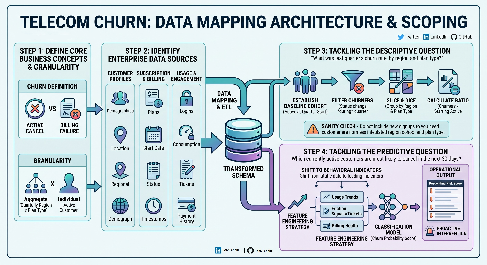

# Telecom Churn: Data Mapping & Problem Scoping

## Overview
In real-world data analytics, stakeholders rarely provide clean, pre-packaged datasets. Instead, they provide a business problem and expect the analyst to define the scope, determine the required data, and design the mapping structure. 

This repository documents a conceptual framework for tackling a **Telecom Churn** problem based purely on analytical intuition and business logic—before writing any code.

## 1. Defining the Problem & Scope
Before querying any databases, "churn" must be explicitly defined for the business context:
* **What counts as churn?** The focus is strictly on *voluntary* churn (customers who actively chose to cancel). We exclude involuntary churn (e.g., accounts closed due to expired credit cards), as that is a separate billing pipeline.
* **The Objectives:** 
  1. Determine exactly what happened last quarter (Descriptive).
  2. Identify behavioral triggers indicating who might leave in the next 30 days (Predictive).

## 2. The Data Requirements
To analyze this problem, the following data fields are required for each customer:
* **Profile Data:** `Customer_ID`, `Region`, and `Plan_Type` (e.g., Basic or Premium).
* **Subscription Timeline:** `Join_Date`, `Cancel_Date` (if applicable), and `Current_Status` (Active or Canceled).
* **Behavioral Data:** `Average_Monthly_Data_Used`, `Data_Used_Last_7_Days`, and `Number_of_Support_Calls_Last_30_Days`.

## 3. Tackling the Descriptive Question
**Goal:** Calculate last quarter's churn rate, by region and plan type.

**Logical Execution:**
1. **Isolate the Starting Cohort:** Filter the dataset to include *only* the customers who were actively subscribed on the exact first day of the previous quarter.
2. **Count the Churners:** Out of that specific starting group, count how many customers changed their status to "Canceled" by the last day of the quarter. 
3. **Calculate the Rate:** Divide the number of canceled customers by the starting number of customers to get the churn percentage. 
4. **Group the Results:** Sort these percentages by the `Region` and `Plan_Type` columns to identify which areas or plans are losing the most customers.

## 4. Tackling the Predictive Question
**Goal:** Identify currently active customers most likely to cancel in the next 30 days.

**Logical Execution:**
Static information (like a customer's region) is insufficient for predicting immediate future actions. Instead, we must monitor recent behavior for leading indicators. This involves building a risk-flagging system based on two main triggers:
1. **The Usage Drop-off:** If a customer typically uses 50GB of data a month, but their `Data_Used_Last_7_Days` suddenly drops to near zero, they have likely stopped using the service and are preparing to cancel.
2. **The Frustration Spike:** If a customer's `Number_of_Support_Calls_Last_30_Days` jumps from zero to three, they are experiencing major friction (e.g., recurring network outages).

**Operational Output:** 
Filter the list of currently active customers to flag anyone exhibiting these behavioral triggers. This "High-Risk List" is then handed to the retention team to proactively reach out or offer a targeted discount before the cancellation occurs.
